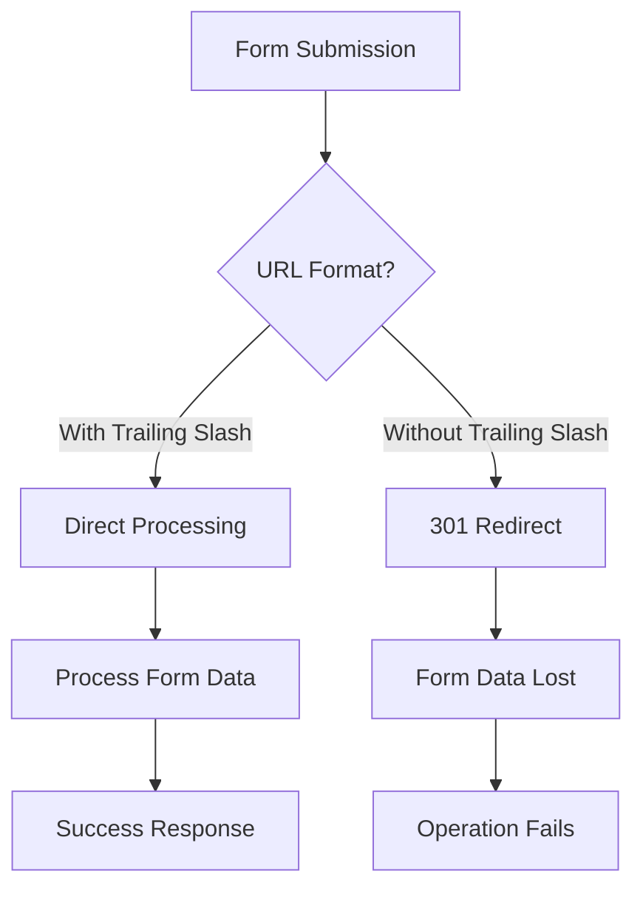
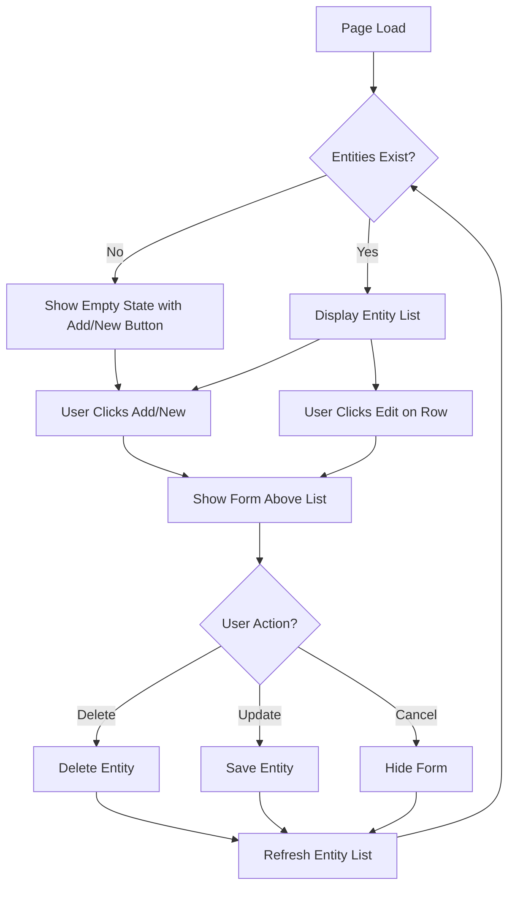
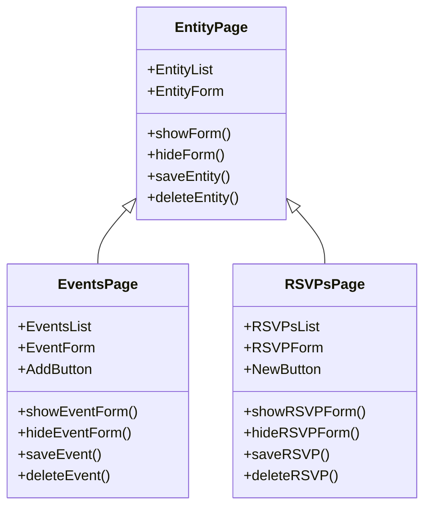
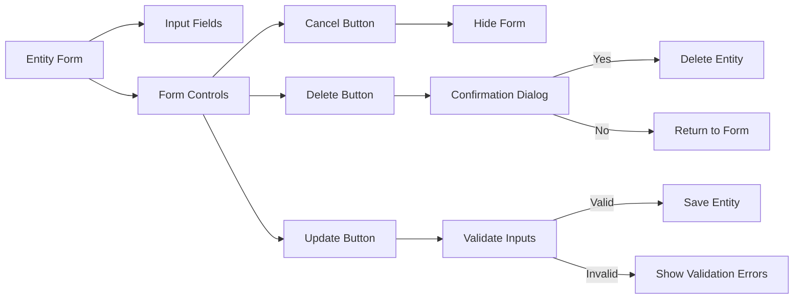

# System Patterns

## 1. Architecture Overview

The QR RSVP Tracker follows a traditional server-side rendered web application architecture with the following components:


## 2. Design Patterns

### 2.1 MVC-like Structure
While not strictly following MVC, the application separates concerns in a similar way:
- **Models**: Data structures and database operations (models package)
- **Views**: HTML templates (templates directory)
- **Controllers**: HTTP handlers and business logic (routes package)

### 2.2 Dependency Injection
The application uses a form of dependency injection through the ApplicationContext struct, which provides access to shared resources:
- Database connection
- Template renderer
- Logger
- Authentication service

### 2.3 Repository Pattern
The models implement a repository-like pattern with methods for CRUD operations:
- `FindByX` methods for retrieval
- `Create` for insertion
- `Save` for updates

### 2.4 Middleware Pattern
HTTP middleware is used for cross-cutting concerns:
- Authentication verification
- Session management
- Logging

## 3. Data Flow

### 3.1 Authentication Flow


### 3.2 Event Creation Flow


### 3.3 RSVP Flow


## 4. Component Relationships

### 4.1 Model Relationships


### 4.2 URL and Form Submission Patterns

The application implements strict patterns for URL consistency and form submissions to ensure proper routing and avoid redirect-related data loss.

#### 4.2.1 Trailing Slash URL Pattern

All resource URLs MUST use trailing slashes to prevent problematic redirects:



- ✅ CORRECT: `/events/` (trailing slash)
- ❌ INCORRECT: `/events` (no trailing slash)

**Trailing Slash Requirement**: When browsers submit forms to URLs without trailing slashes, the server responds with a 301 redirect to the same URL with a trailing slash. During this redirect:
- The browser changes the request from POST to GET
- All form data is lost, including method override parameters
- As a result, DELETE operations fail silently

#### 4.2.2 Form Submission Pattern

Form submissions must follow these patterns:

1. **Action URLs**: All form action attributes must use trailing slashes
   ```html
   <form action="/events/" method="POST">
   ```

2. **Parameter Passing**: Use hidden form fields rather than query parameters
   ```html
   <input type="hidden" name="event_id" value="{{.ID}}">
   ```
   
3. **Method Overrides**: For non-GET/POST methods (PUT, DELETE), use the _method override parameter
   ```html
   <input type="hidden" name="_method" value="DELETE">
   ```

#### 4.2.3 RESTful API Routes

The application follows a RESTful API approach for its routes, using form data for parameters:

##### Event Routes
- `GET /events/` - Lists all events
- `POST /events/` - Creates a new event
- `GET /events/?event_id={id}` - Shows a specific event
- `POST /events/` with event_id and fields - Updates an event
- `POST /events/` with _method=DELETE and event_id - Deletes an event

##### RSVP Routes
- `GET /rsvps/?event_id={id}` - Lists RSVPs for an event
- `POST /rsvps/` with event_id - Creates a new RSVP
- `GET /rsvps/?rsvp_id={id}` - Shows a specific RSVP
- `POST /rsvps/` with rsvp_id and fields - Updates an RSVP
- `POST /rsvps/` with _method=DELETE and rsvp_id - Deletes an RSVP

### 4.3 Handler Organization
Each HTTP operation is implemented in a dedicated file following RESTful naming conventions:

#### Event Handlers
- `list.go` - Handles listing events
- `create.go` - Handles creating events
- `show.go` - Handles showing a specific event
- `update.go` - Handles updating events
- `delete.go` - Handles deleting events

#### RSVP Handlers
- `list.go` - Handles listing RSVPs
- `create.go` - Handles creating RSVPs
- `show.go` - Handles showing a specific RSVP
- `update.go` - Handles updating RSVPs
- `delete.go` - Handles deleting RSVPs

### 4.4 Resource Router Pattern
The application implements a generic resource router pattern to standardize routing across different resource types:


The resource router:
- Extracts resource IDs from query parameters
- Handles method overrides for browsers that don't support PUT/DELETE
- Routes requests to the appropriate handler based on HTTP method and presence of IDs
- Provides consistent error handling for unsupported methods
- Supports parent-child relationships through parent ID parameters

### 4.5 Base Handler Pattern
The application implements a base handler pattern to reduce code duplication across handlers:


### 4.6 UI Design Patterns

The application follows consistent UI design patterns to provide a unified experience across different resource types. The Events and RSVPs pages share identical behavioral patterns, creating a predictable and learnable interface.

#### 4.6.1 In-Page Form Pattern

Both Events and RSVPs management pages implement an in-page form pattern that keeps users in context while performing CRUD operations:



#### 4.6.2 Consistent Entity Management

The Events and RSVPs pages follow parallel structures with identical interaction patterns:



#### 4.6.3 Empty State Pattern

The application handles empty states (when no entities exist) consistently:

1. For Events page:
   - When a user has no events, the page displays an "Add" button prominently
   - Clicking this button reveals the event creation form above the (empty) events table

2. For RSVPs page:
   - When an event has no RSVPs, the page displays a "New" button prominently
   - Clicking this button reveals the RSVP creation form above the (empty) RSVPs table

This consistent approach ensures that users always have a clear path to creating their first entity of each type.

#### 4.6.4 Form Controls Pattern

All entity forms follow a consistent control pattern:



This consistent approach to form controls ensures that users develop muscle memory for common operations across the application.

The base handler:
- Provides a consistent interface for common handler operations
- Centralizes authentication and authorization checks
- Standardizes parameter extraction and validation
- Offers typed error handling with appropriate HTTP status codes
- Simplifies template rendering with consistent data structures
- Provides helper methods for common redirection patterns

### 4.4 Package Structure
The application is organized into the following packages:
- `cmd/web`: Application entry point
- `models`: Data models and database operations
- `pkg/config`: Configuration structures
- `pkg/handlers`: HTTP handlers organized by resource type
  - `pkg/handlers/event`: Event-related handlers
  - `pkg/handlers/rsvp`: RSVP-related handlers
- `pkg/routes`: Route registration and middleware
- `pkg/services`: Service implementations
- `pkg/utils`: Utility functions

## 5. Key Technical Decisions

### 5.1 Server-Side Rendering
The application uses Go's template system for server-side rendering rather than a client-side framework. This simplifies the architecture and reduces client-side dependencies.

### 5.2 SQLite Database
SQLite was chosen for its simplicity and zero-configuration setup, making the application easy to deploy without external database dependencies.

### 5.3 GORM ORM
GORM provides a clean abstraction over the database, handling migrations and CRUD operations with minimal boilerplate.

### 5.4 Google OAuth
Google OAuth was selected for authentication to leverage existing user accounts and avoid the complexity of managing passwords.

### 5.5 ID Generation System
The application uses a sophisticated ID generation system with different encoding schemes for different models:


- **Base62 IDs** (0-9, A-Z, a-z) are used for User and Event models
- **Base36 IDs** (0-9, A-Z) are used for RSVP models to make them more user-friendly for sharing
- All IDs are 8 characters long by default
- The system uses `crypto/rand` for cryptographically secure random generation
- Uniqueness is verified against the database before assignment
- The system attempts to generate a unique ID up to 10 times before failing

This approach provides:
- Human-readable IDs that are URL-safe
- Sufficient entropy to prevent guessing
- Different character sets for different use cases (RSVPs use Base36 for better readability)
- Collision detection and handling

### 5.6 Code Quality Patterns

The application follows strict code quality patterns to ensure maintainability and reliability:


#### 5.6.1 Integration Testing Pattern
- Integration tests use real dependencies without mocks
- Each test is isolated through proper setup and teardown procedures
- Database and services are initialized with test configurations
- Tests verify end-to-end functionality rather than isolated units

#### 5.6.2 Variable Naming Pattern
- All variables have full, descriptive names
- Single or two-letter variable names are prohibited
- Names clearly indicate the purpose and content of the variable
- Consistent naming conventions across the codebase

#### 5.6.3 Error Handling Pattern
- Centralized error handling utilities in dedicated packages
- Consistent error propagation throughout the application
- No silent error suppression, even in defer statements
- Errors are logged and properly handled at appropriate levels

#### 5.6.4 String Constants Pattern
- String literals are defined as constants in dedicated packages
- Query parameter names are defined as typed constants
- Environment variables for deployment-specific values
- No inline string literals in business logic

---

**Last Updated:** 03/16/2025
